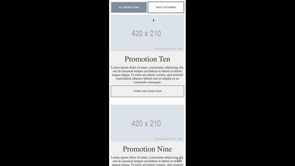
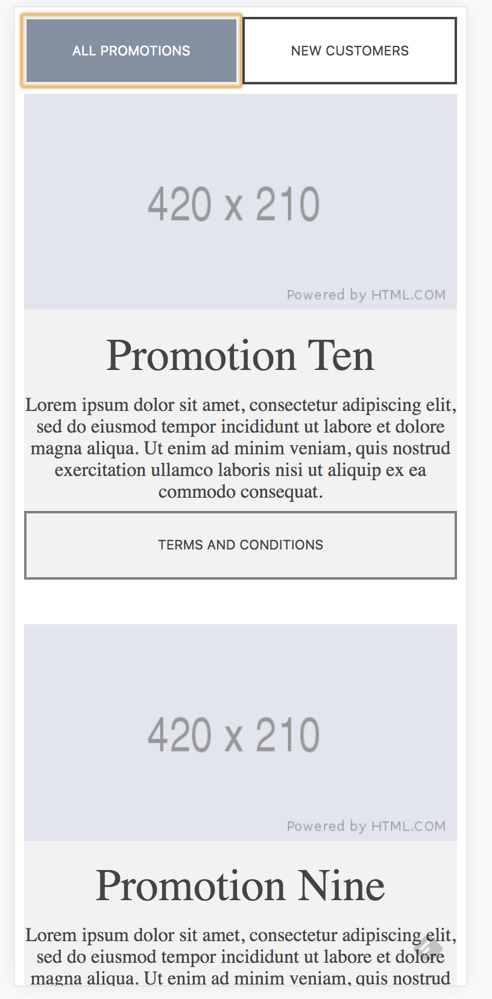
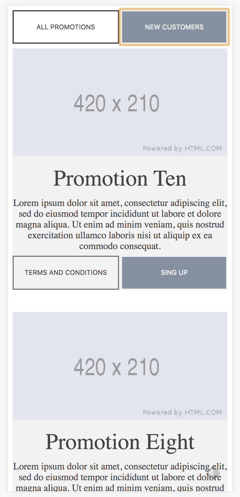

# addisonglobal web-technical-test  

- Description source: [challenge](https://github.com/addisonglobal/web-technical-test)
- Data source: [challenge API](https://github.com/addisonglobal/web-technical-test/blob/master/data.json)

## Demo

## Result
- Here is how screen looks on initial load.

- Here is how screen looks after clicking on `NEW CUSTOMERS` button
	- `NEW CUSTOMERS` buttons is highlighted (in color grey/blue).
	- `ALL PROMOTIONS` button is not highlighted (in color white). It was highlighted before.
	- Only new customers related promotions are displayed now. All promotions were displayed before.
	- `SIGN UP` button is displaying next to `TERMS AND CONDITIONS` button. Only `TERMS AND CONDITIONS` button displayed before.
	

- On clicking `ALL PROMOTIONS`, we are seeing similar view as on-load.